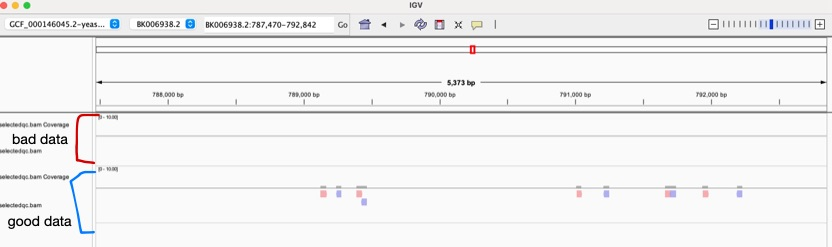

# Week 9: Filter a BAM file

run the following commands from the makefile to generate the files needed

````
usage:
	@echo                "# ACC=${ACC}"
	@echo "make dir      # Make the directories "
	@echo "make ref        # Get the reference genome "
	@echo "make SRA              # Fetch sequence data from SRA (fastq format)"
	@echo "make index            # Index the genome"
	@ echo "make align           # Align the reads"
	@echo "make bam              # Sort the SAM file to BAM"
	@echo "make sam        # Index the BAM file"

````

#### How many reads did not align with the reference genome?

````
make unmap 
````

gives me the output 

````
19745
````

#### How many primary, secondary, and supplementary alignments are in the BAM file?

````
make stat
````

outputs 

````
samtools flagstat bam/SRR30805512.bam
20108 + 0 in total (QC-passed reads + QC-failed reads)
20000 + 0 primary
0 + 0 secondary
108 + 0 supplementary
0 + 0 duplicates
0 + 0 primary duplicates
363 + 0 mapped (1.81% : N/A)
255 + 0 primary mapped (1.27% : N/A)
20000 + 0 paired in sequencing
10000 + 0 read1
10000 + 0 read2
0 + 0 properly paired (0.00% : N/A)
20 + 0 with itself and mate mapped
235 + 0 singletons (1.17% : N/A)
8 + 0 with mate mapped to a different chr
3 + 0 with mate mapped to a different chr (mapQ>=5)
````


#### How many properly-paired alignments on the reverse strand are formed by reads contained in the first pair ?

````
make proper
````

gives the output 

````
0
````

#### Make a new BAM file that contains only the properly paired primary alignments with a mapping quality of over 10

````
make mapq
````

you get the output 

````
0
````

it creates the bam file, but there is nothing to see on this file 

#### Compare the flagstats for your original and your filtered BAM file.

````
make qstat
````

````
0 + 0 in total (QC-passed reads + QC-failed reads)
0 + 0 primary
0 + 0 secondary
0 + 0 supplementary
0 + 0 duplicates
0 + 0 primary duplicates
0 + 0 mapped (N/A : N/A)
0 + 0 primary mapped (N/A : N/A)
0 + 0 paired in sequencing
0 + 0 read1
0 + 0 read2
0 + 0 properly paired (N/A : N/A)
0 + 0 with itself and mate mapped
0 + 0 singletons (N/A : N/A)
0 + 0 with mate mapped to a different chr
0 + 0 with mate mapped to a different chr (mapQ>=5)
(bioinfo) 

````

# Does using good sequencing data result in better filtering 

How many reads did not align with the reference genome?
````
6615
````

How many primary, secondary, and supplementary alignments are in the BAM file?
````
samtools flagstat bam/SRR11466505.bam
20000 + 0 in total (QC-passed reads + QC-failed reads)
20000 + 0 primary
0 + 0 secondary
0 + 0 supplementary
0 + 0 duplicates
0 + 0 primary duplicates
13385 + 0 mapped (66.93% : N/A)
13385 + 0 primary mapped (66.93% : N/A)
20000 + 0 paired in sequencing
10000 + 0 read1
10000 + 0 read2
11672 + 0 properly paired (58.36% : N/A)
11684 + 0 with itself and mate mapped
1701 + 0 singletons (8.51% : N/A)
10 + 0 with mate mapped to a different chr
7 + 0 with mate mapped to a different chr (mapQ>=5
````

How many properly-paired alignments on the reverse strand are formed by reads contained in the first pair ?
````
2900
````

Make a new BAM file that contains only the properly paired primary alignments with a mapping quality of over 10



Compare the flagstats for your original and your filtered BAM file.
````
samtools flagstat selectedqc.bam
10426 + 0 in total (QC-passed reads + QC-failed reads)
10426 + 0 primary
0 + 0 secondary
0 + 0 supplementary
0 + 0 duplicates
0 + 0 primary duplicates
10426 + 0 mapped (100.00% : N/A)
10426 + 0 primary mapped (100.00% : N/A)
10426 + 0 paired in sequencing
5215 + 0 read1
5211 + 0 read2
10426 + 0 properly paired (100.00% : N/A)
10426 + 0 with itself and mate mapped
0 + 0 singletons (0.00% : N/A)
0 + 0 with mate mapped to a different chr
0 + 0 with mate mapped to a different chr (mapQ>=5)
````